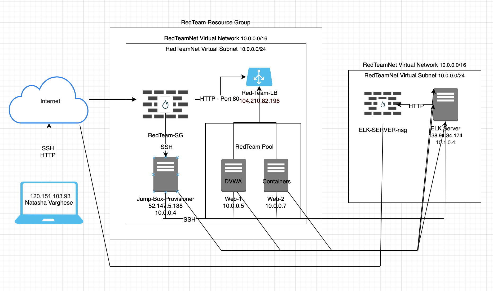
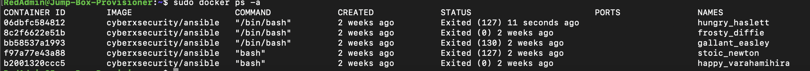

## Automated ELK Stack Deployment

The files in this repository were used to configure the network depicted below.

These files have been tested and used to generate a live ELK deployment on Azure. They can be used to either recreate the entire deployment pictured above. Alternatively, select portions of the _____ file may be used to install only certain pieces of it, such as Filebeat.

[My Playbook](https://drive.google.com/file/d/1hcWUfc50b36RamZquPxvh5RLe1uALF-n/view?usp=sharing) 
[Pentest File](https://drive.google.com/file/d/1w5PT2HP_Fwv2t5BoQEKxgAOgUymTtASL/view?usp=sharing)

This document contains the following details:
- Description of the Topolog
- Access Policies
- ELK Configuration
  - Beats in Use
  - Machines Being Monitored
- How to Use the Ansible Build

### Description of the Topology

The main purpose of this network is to expose a load-balanced and monitored instance of DVWA, the D*mn Vulnerable Web Application.

Load balancing ensures that the application will be highly availability, in addition to restricting overflow to the network.
Load Balancing plays an important security role as computing moves evermore to the cloud. The off-loading function of a load balancer defends an organization against distributed denial-of-service (DDoS) attacks. 

Integrating an ELK server allows users to easily monitor the vulnerable VMs for changes to the Filebeat and system Metricbeat.
Filebeat monitors the log files or locations that you specify, collects log events, and forwards them either to Elasticsearch or Logstash for indexing.
Metricbeats is a lightweight shipper that you can install on your servers to periodically collect metrics from the operating system and from services running on the server.

The configuration details of each machine may be found below.
_Note: Use the [Markdown Table Generator](http://www.tablesgenerator.com/markdown_tables) to add/remove values from the table_.

| Name     | Function | IP Address | Operating System |
|----------|----------|------------|------------------|
| Jump Box | Gateway  | 10.0.0.4   | Linux            |
| Web1     | Private  | 10.0.0.5   | Linux            |
| Web2     | Private  | 10.0.0.7   | Linux            |       

### Access Policies

The machines on the internal network are not exposed to the public Internet. 

Only the Jump Box Provisioner machine can accept connections from the Internet. Access to this machine is only allowed from the following IP addresses:
52.147.5.138

Machines within the network can only be accessed by the Gateway VM .
Web 1 (10.0.0.5) and Web 2 (10.0.0.7).

A summary of the access policies in place can be found in the table below.

| Name     | Publicly Accessible | Allowed IP Addresses |
|----------|---------------------|----------------------|
| Jump Box | Yes/No              | 10.0.0.4             |
| Web1     |   No                | 10.0.0.5             |
| Web2     |   No                | 10.0.0.7             |

### Elk Configuration

Ansible was used to automate configuration of the ELK machine. No configuration was performed manually, which is advantageous because...
The primary benefit of Ansible is it allows IT administrators to automate away the drudgery from their daily tasks. That frees them to focus on efforts that help deliver more value to the business by spending time on more important tasks.

The playbook implements the following tasks:

1. Create a new Virtual Network - to allow access between the VM's
2. Create a new Virtual Machines
3. Create a new playbook - to automate a set of tasks.

The following screenshot displays the result of running `docker ps` after successfully configuring the ELK instance.

### Target Machines & Beats
This ELK server is configured to monitor the following machines:
- Jump Box Provisioner
- Web1
- Web2

We have installed the following Beats on these machines:
Filebeats
Metricbeat

These Beats allow us to collect the following information from each machine:
Filebeat - Collects data about the file system
Metricbeat - Collects machine metrics, such as uptime. 

### Using the Playbook
In order to use the playbook, you will need to have an Ansible control node already configured. Assuming you have such a control node provisioned: 

SSH into the control node and follow the steps below:
- Copy the my-playbook. file to _____.
- Update the _____ file to include...
- Run the playbook, and navigate to ____ to check that the installation worked as expected.

_TODO: Answer the following questions to fill in the blanks:_
- _Which file is the playbook? Where do you copy it?_
- _Which file do you update to make Ansible run the playbook on a specific machine? How do I specify which machine to install the ELK server on versus which to install Filebeat on?_
- _Which URL do you navigate to in order to check that the ELK server is running?

_As a **Bonus**, provide the specific commands the user will need to run to download the playbook, update the files, etc._
